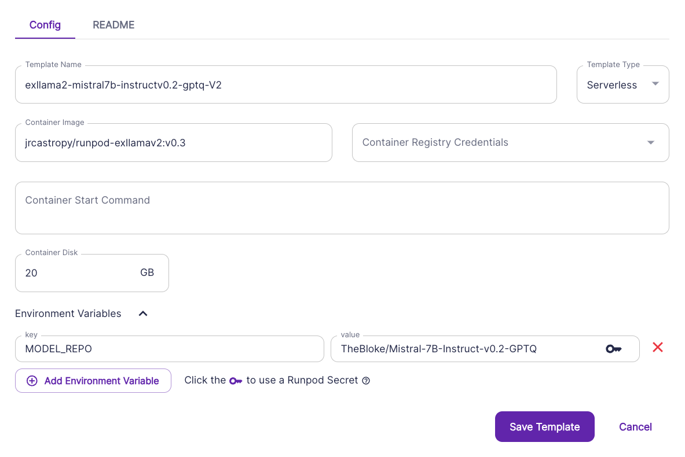
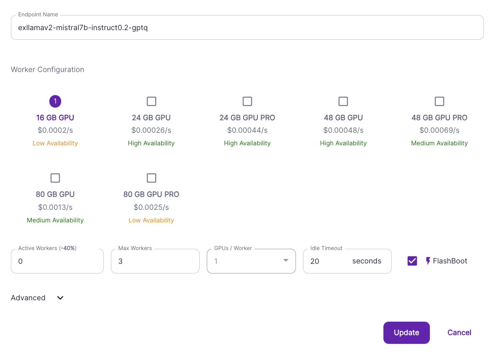

# runpod-worker-exllamav2

> [!NOTE]  
> [GPTQ](https://arxiv.org/abs/2210.17323) models with fast
> [ExLlamaV2](https://github.com/turboderp/exllamav2) inference on
> [RunPod](https://runpod.io?ref=2xxro4sy) Serverless.
> 
> This is based on Yushi Homma's [exllama-runpod-serverless](
> https://github.com/hommayushi3/exllama-runpod-serverless) repo,
> but has been rewritten for exllamav2.

## Summary

This Docker image runs a GPTQ model on a serverless RunPod worker
using the optimized [turboderp's exllamav2 repo](
https://github.com/turboderp/exllamav2).

This was also a repo from ashleyk [ashleyk's github](https://github.com/ashleykleynhans/runpod-worker-exllamav2)

## Set Up

1. Create a [RunPod](https://runpod.io?ref=go7ef7ba) account and
   navigate to the [Serverless Console](https://www.runpod.io/console/serverless).
2. (Optional) Create a Network Volume to cache your model to speed
   up cold starts (but will incur some cost per hour for storage).
    - *Note: Only certain Network Volume regions are compatible with certain instance types on RunPod, so try out if your Network Volume makes your desired instance type Unavailable, try other regions for your Network Volume.*



3. Navigate to `Templates` and click on the `New Template` button.
4. Enter in the following fields and click on the `Save Template` button:

    | Template Field  | Value                                                                         |
    |-----------------|-------------------------------------------------------------------------------|
    | Template Name   | `exllama2-mistral7b-instructv0.2-gptq-V2`                                     |
    | Container Image | `jrcastropy/runpod-exllamav2:v0.3`                                            |
    | Container Disk  | A size large enough to store your libraries + your desired model in 4bit. 20gb|

    - Container Disk Size Guide:
        | Model Parameters | Storage & VRAM |
        | --- | --- |
        | 7B | 6GB |
        | 13B | 9GB |
        | 33B | 19GB |
        | 65B | 35GB |
        | 70B | 38GB |

    - Environment Variables:

        | Environment Variable | Example Value |
        | --- | --- |
        | (Required) `MODEL_REPO` | `TheBloke/Mistral-7B-Instruct-v0.2-GPTQ` or any other repo for GPTQ Mistral model. See https://huggingface.co/models?other=llama&sort=trending&search=thebloke+gptq for other models. Must have `.safetensors` file(s). |
        | (Optional) `MAX_SEQ_LEN` | `4096` |
        | (Optional) `ALPHA_VALUE` | `1` |
        | (If using Network Volumes) `HUGGINGFACE_HUB_CACHE` | `/runpod-volume/hub` |
        | (If using Network Volumes) `TRANSFORMERS_CACHE` | `/runpod-volume/hub` |



4. Now click on `Serverless` and click on the `New Endpoint` button.
5. Fill in the following fields and click on the `Create` button:
    | Endpoint Field | Value |
    | --- | --- |
    | Endpoint Name | `exllamav2-mistral7b-instruct0.2-gptq` |
    | Select Template | `exllama2-mistral7b-instructv0.2-gptq-V2` |
    | Min Provisioned Workers | `0` |
    | Max Workers | `3` |
    | Idle Timeout | `20` seconds |
    | FlashBoot | Checked/Enabled |
    | GPU Type(s) | Use the `Container Disk` section of step 3 to determine the smallest GPU that can load the entire 4 bit model. In our example's case, use 16 GB GPU. Make smaller if using Network Volume instead. |
    | (Optional) Network Volume | `container-mistral7b` |

## Inference Usage

See the `predict.py` file for an example.

Run the `predict.py` using the following command in terminal with
the RunPod endpoint id assigned to your endpoint in step 5.

```bash
RUNPOD_AI_API_KEY='**************' RUNPOD_ENDPOINT_ID='*******' python predict.py
```

To run with streaming enabled, use the `--stream` option.
To set generation parameters, use the `--params_json` option
to pass a JSON string of parameters:

```bash
RUNPOD_AI_API_KEY='**************' RUNPOD_ENDPOINT_ID='*******' python predict.py --params_json '{"temperature": 0.3, "max_tokens": 1000, "prompt_prefix": "USER: ", "prompt_suffix": "ASSISTANT: "}'
```

You can generate the API key under your [RunPod Settings](
https://www.runpod.io/console/serverless/user/settings) under `API Keys`.

## Build your own docker image

If you want to build the image yourself, please see the `tutorial.txt`

## Appreciate Ashleyk's work?

<a href="https://www.buymeacoffee.com/ashleyk" target="_blank"></a>

